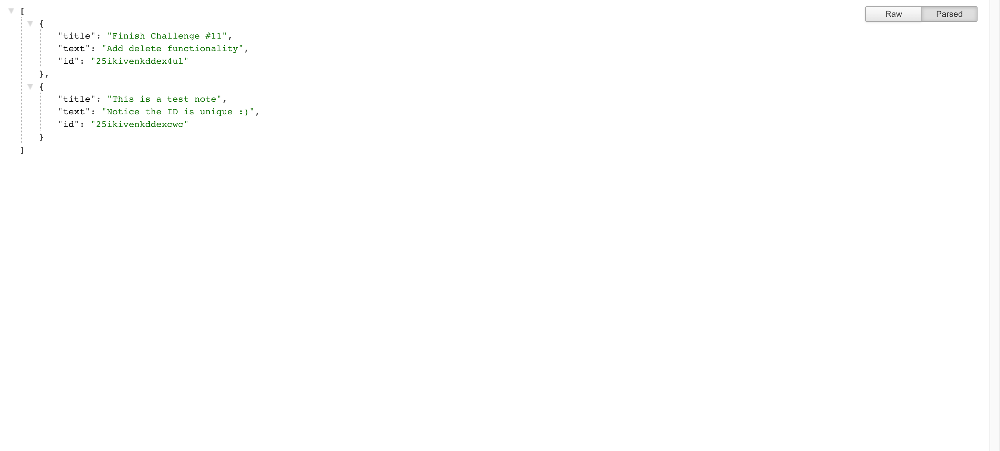
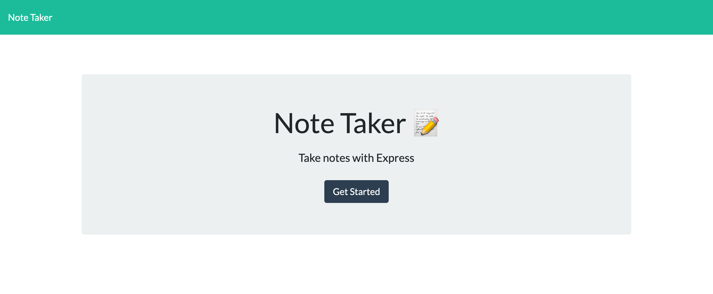
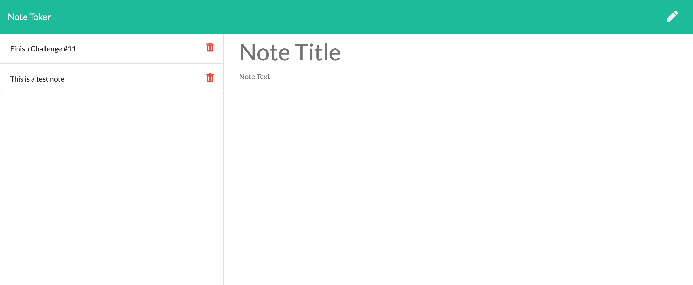

# Note Taker Application  

## Description: 

This application allows notes to be created, saved, and deleted using Express.js servers. When adding a new note, you can click the save button to see the new note saved to the left hand column. Behind the scenes, this new note will be saved to the server. When clicking on a previously saved note, the note will appear on the right hand side showing the full note details. If you wish to delete a note, you can click on the delete button, the note will be removed from the page and the server's database. 

Using Express.js, the HTML GET routes were created to connect the index.html with * and notes.html file with /notes. Additionally, the API routes were created at /api/notes. POST and DELETE routes update the db.json file.

Additionally, the npm package uniqid is used to assign a unique ID to each note. 

## Table of Contents
* [Built With](#builtwith)
* [Screenshots](#screenshots)
* [Deployed Application](#deployedapplication)
* [Questions](#questions)

## Built With
* HTML
* CSS / Bootstrap
* Javascript
* Node
* Express.js
* NPM Package - uniqid

## Screenshots
* See api/notes route 

* See / route (index.html)

* See /notes route (notes.html)

## Deployed Application Link
https://sleepy-tor-61565.herokuapp.com/
    

## Questions? 

If you have any additional questions, feel free to contact me: 
GitHub: https://github.com/MelissaBCadena 
Email: melissabcadena@gmail.com
